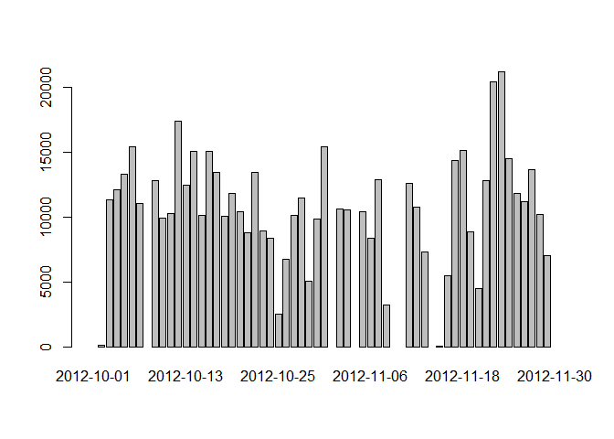
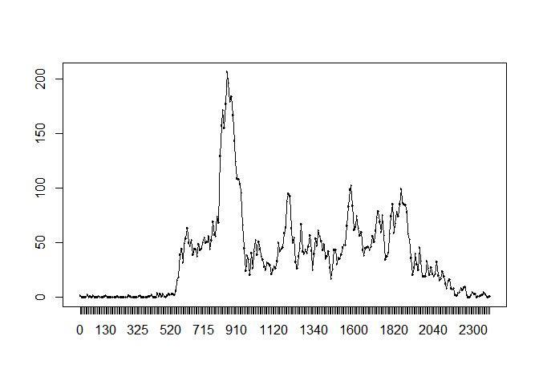

# Reproducible Research: Peer Assessment 1

## Loading and preprocessing the data

* load the data

```r
unzip(zipfile = "activity.zip");
act<-read.csv(file = "./activity.csv",header = TRUE);
```

* process the data

```r
actna<-act[!is.na(act$steps),];
```

## What is mean total number of steps taken per day?

* histogram of the total number of steps per day

```r
stepsdays<-as.data.frame.table(x = tapply(X = actna$steps,INDEX = actna$date,FUN = sum));
barplot(height = stepsdays[,2],names.arg = stepsdays[,1])
```

 

* **mean** and **median**

```r
meanstepdays<-as.data.frame.table(x = tapply(X = actna$steps,INDEX = actna$date,FUN = mean));
medstepdays<-as.data.frame.table(x = tapply(X = actna$steps,INDEX = actna$date,FUN = median));
```

## What is the average daily activity pattern?
* time series plot 5 minute interval

```r
meanstepinter<-as.data.frame.table(x = tapply(X = actna$steps,INDEX = actna$interval,FUN = mean));
plot(x = meanstepinter[,1],y = meanstepinter[,2],type="l")
```

 

* 5 minute interval with maximum number of steps

```r
meanstepinter[max(meanstepinter[,2]),1]
```

```
## [1] 1705
## 288 Levels: 0 5 10 15 20 25 30 35 40 45 50 55 100 105 110 115 120 ... 2355
```

## Imputing missing values


## Are there differences in activity patterns between weekdays and weekends?
