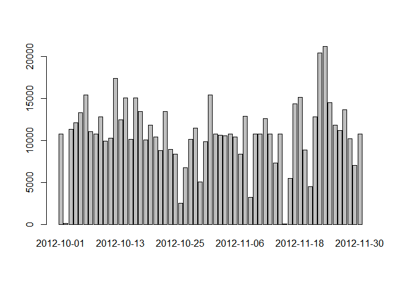
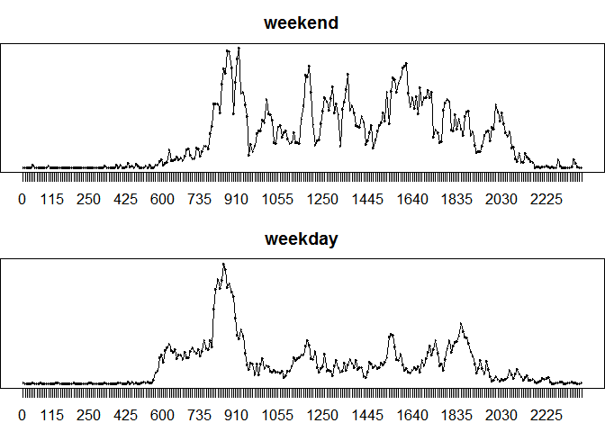

# Reproducible Research: Peer Assessment 1

## Loading and preprocessing the data

* load the data

```r
unzip(zipfile = "activity.zip");
act<-read.csv(file = "./activity.csv",header = TRUE);
```

* process the data

```r
actna<-act[!is.na(act$steps),];
```

## What is mean total number of steps taken per day?

* histogram of the total number of steps per day

```r
stepsdays<-as.data.frame.table(x = tapply(X = actna$steps,INDEX = actna$date,FUN = sum));
barplot(height = stepsdays[,2],names.arg = stepsdays[,1])
```

 

* **mean** and **median**

```r
meanstepdays<-as.data.frame.table(x = tapply(X = actna$steps,INDEX = actna$date,FUN = mean));
medstepdays<-as.data.frame.table(x = tapply(X = actna$steps,INDEX = actna$date,FUN = median));
```

## What is the average daily activity pattern?
* time series plot 5 minute interval

```r
meanstepinter<-as.data.frame.table(x = tapply(X = actna$steps,INDEX = actna$interval,FUN = mean));
plot(x = meanstepinter[,1],y = meanstepinter[,2],type="l")
lines(x = meanstepinter[,1],y = meanstepinter[,2],type="l")
```

 

* 5 minute interval with maximum number of steps

```r
meanstepinter[max(meanstepinter[,2]),1]
```

```
## [1] 1705
## 288 Levels: 0 5 10 15 20 25 30 35 40 45 50 55 100 105 110 115 120 ... 2355
```

## Imputing missing values
* total number of missing values

```r
sum(is.na(x = act$steps))
```

```
## [1] 2304
```

* create new dataset and devise a strategy for filling all missing values
(in this case the mean for that 5 minute interval)

```r
actnona<-act;
for(i in 1:dim(actnona)[1]){
  if(is.na(actnona[i,1])){
    actnona[i,1]<-meanstepinter[meanstepinter$Var1==actnona[i,3],2];
  }
}
```

* compare with the previous histogram and mean and median
  + new histogram of the total number of steps per day

```r
stepsdays1<-as.data.frame.table(x = tapply(X = actnona$steps,INDEX = actnona$date,FUN = sum));
barplot(height = stepsdays1[,2],names.arg = stepsdays1[,1])
```

 

  + new **mean** and **median**

```r
meanstepdays1<-as.data.frame.table(x = tapply(X = actnona$steps,INDEX = actnona$date,FUN = mean));
medstepdays1<-as.data.frame.table(x = tapply(X = actnona$steps,INDEX = actnona$date,FUN = median));
```
*average, mean and median are all higher than previously*


## Are there differences in activity patterns between weekdays and weekends?

* new factor variable for weekend

```r
actwk<-weekdays(as.Date(x = actnona[,2],format = "%Y-%m-%d"));
actend<-cbind(actnona,0);
for(i in 1:dim(actnona)[1]){
  if(any(actwk[i]=="Sunday",actwk[i]=="Saturday")){
    actend[i,4]<-"weekend";
  }else{
    actend[i,4]<-"weekday";
  }
}
actend[,4]<-as.factor(actend[,4]);
```

* panel plot time series

```r
wgr<-split(x = actend,f = actend[,4]);
meanstepinterend<-as.data.frame.table(x = tapply(X = wgr$weekend$steps,INDEX = wgr$weekend$interval,FUN = mean));
meanstepinterweek<-as.data.frame.table(x = tapply(X = wgr$weekday$steps,INDEX = wgr$weekday$interval,FUN = mean));
par(mfrow = c(2,1),mai = c(0.5,0,0.5,0))
plot(x = meanstepinterend[,1],y = meanstepinterend[,2],type="l",main="weekend")
lines(x = meanstepinterend[,1],y = meanstepinterend[,2],type="l")
plot(x = meanstepinterweek[,1],y = meanstepinterweek[,2],type="l",main="weekday")
lines(x = meanstepinterweek[,1],y = meanstepinterweek[,2],type="l")
```

 
